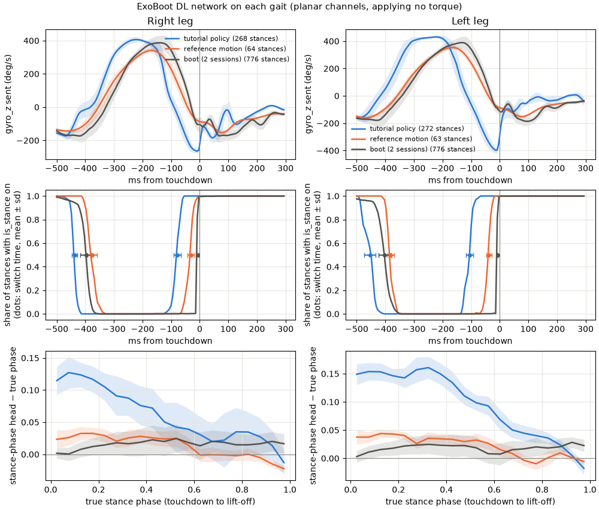

# ExoBoot DL task — the 4-headed network drives the exo, the policy learns muscles only

The NeuMove ExoBoot's DL task (`Task.WALKJOGDLGAITPHASE`, as the boot ran it with `mle_config.py`), ported to run
inside the RL env in place of the policy's exo torque, at the boot's own 175 Hz, from simulated boot sensors. A
network recovered from the boot's Jetson reads each leg's IMU and ankle; its stance/swing and stance-phase heads give the
gait events and phase, and the four-point spline (4PTS, `../exoboot_spline/`) applies torque in stance. The policy
still emits the two exo actions; the controller overrides them on every physics substep. Code:
`myoassist_utils/exo_ctrl/dl_controller.py`, `boot_sensors.py`, `gait_net.py`; the in-loop seam is
`rl_train/envs/device_control.py`.

| config | exo |
|---|---|
| `imitation_22_DephyExoBoot_L1_exoboot_dl.json` | the DL task at 175 Hz, inside the 1200 Hz physics |
| `imitation_22_DephyExoBoot_L1_exoboot_dl_shadow.json` | the same, applying no torque (`shadow_mode`) |

Both are the 4PTS experiment with `device_controller` `"exoboot_dl"`. The exo-off baseline is 4PTS's
(`../exoboot_spline/imitation_22_DephyExoBoot_L1_exo_off.json`): the shadow config reproduces it bit for bit (tested),
so it is the way to watch the network on a policy that walks without it.

## Getting started

The code is on the `feat/exoboot-dl` branch, on top of 4PTS. Install as the repo's own README says
(`uv pip install -e .`) from a clone of that branch, then, from the repo root, run the tests (the DL ones are
`tools/tests/test_gait_net.py`, `test_boot_sensors.py`, `test_dl_controller.py`, `test_replay_dl_session.py`,
`test_calibrate_boot_sensors.py`, and the DL parts of `test_rollout_controllers.py` and
`test_render_controller_video.py`):

```bash
python -m pytest tools/tests -q
```

Train with the DL task (but read [Tested on a trained policy](#tested-on-a-trained-policy-the-network-fails-in-the-dynamic-sim)
first: on the policy tested, the network's phase is well off):

```bash
python rl_train/run_train.py --config_file_path rl_train/train/train_configs/exoboot_dl/imitation_22_DephyExoBoot_L1_exoboot_dl.json
```

Train the 4PTS exo-off baseline first and check the DL task on its rollouts with `tools/rollout_controllers.py`
(below). Every controller field is overridable from the command
line as `--config.env_params.exo_controller_params.<field> <value>`. As for 4PTS, the boot's 3 N·m spline bias is off
here (`bias_torque` 0): it keeps the boot's Bowden cable taut, and there is no cable in the simulation.

Evaluation, scoring and `exo_phase_valid` work as for 4PTS (`../exoboot_spline/README.md`, Evaluate). For the DL task
`exo_phase_valid` is the share of steps with assistance on and a phase from the network.

## What runs every 175 Hz tick

1. **Sensors** (`boot_sensors.py`), per leg, the 8 channels the boot's Pi sends its Jetson: accel x/y/z (g) and gyro
   x/y/z (deg/s) from an IMU in the actuator pack on the lateral shank (x forward, y up the shank, z outward; the left
   leg's frame left-handed, as on the boot), turned on the shank as the boots were; the ankle angle (deg,
   plantarflexion-positive) reading the boot's relaxed standing angle at the standing keyframe, and its velocity
   (difference + 10 Hz Butterworth). The Dephy's resolution, then rounded to 5 decimals as the Pi sends them.
2. **The network** (`gait_net_4headed.npz`, recovered from the Jetson's TensorRT engine by `tools/recover_gait_net.py`)
   on each leg's zero-filled 200-sample buffer. Each leg uses the reply to the previous tick, as on the boot, rounded
   as the Jetson sends it.
3. **The boot's DL estimator:** heel strike / toe-off = rising / falling edges of is_stance; gait phase = 0.6 x the
   stance-phase head; the speed head low-passed at 0.5 Hz.
4. **The boot's state machine** (`boot_state.py`): reel-in on a heel strike (157 ms), stance with the four-point spline
   on the gait phase, reel-out on toe-off (172 ms), swing. The boot ends reel-in and reel-out on cable slack or a
   timeout; there is no cable here, so they last the boot's mean durations on the validation sessions.
5. **Speed activation** switches assistance on and off (below).

Each leg's `diagnostics()` reports, besides the torque, phase and state the env and the rollout tool read: is_stance,
the stance-phase and speed heads as received, the filtered speed, whether assistance is on, and the gyro channels it
sent.

## When it applies torque, and how to change it

Three things decide when the DL task first applies torque. All are fields of `exo_controller_params`.

1. **Once per episode: the network's window and speed activation.** The network starts each episode on a zero-filled
   200-sample buffer (1.14 s), and assistance stays off until its speed, low-passed (2nd-order Butterworth, 0.5 Hz),
   crosses up through `dl_speed_on` (0.7 m/s); it goes off again when the filtered speed falls through `dl_speed_off`
   (0.5 m/s). This is the boot's own `DL_SPEEDACTIVATION` logic. On the tutorial policy (below) assistance comes on
   1.0 s into each episode, as the filtered speed rises from 0 through 0.7 m/s, and stays on. To change when, move
   `dl_speed_on` (it must stay above `dl_speed_off`); to skip the criterion and assist from the first heel strike with
   a phase, set `dl_assist_on "always"`:

   ```bash
   python rl_train/run_train.py --config_file_path rl_train/train/train_configs/exoboot_dl/imitation_22_DephyExoBoot_L1_exoboot_dl.json \
     --config.env_params.exo_controller_params.dl_assist_on always
   ```

2. **Every stride: reel-in.** Torque starts once `reel_in_time` (0.157 s) has passed after the heel strike, and then
   follows the spline, which with no bias is zero until the gait phase reaches `rise_fraction` (0.278), i.e. stance
   phase 0.46.
3. **Every stride: toe-off.** Torque ends at the network's toe-off (is_stance falling), when the gait phase is at most
   0.6, mid-fall of the spline (`fall_fraction` 0.641 lies past it).

## Validated against the boot

On the DL validation sessions (two sessions of one participant, both legs, ~79k rows each, 35 s to the end of
assistance), `tools/replay_dl_session.py` replays a session log through the port one layer at a time, each fed the
boot's own logged inputs:

```bash
python tools/replay_dl_session.py "<session dir>/<date>_<time>_<subject>_<trial>_" \
  --weights rl_train/train/train_configs/exoboot_dl/gait_net_4headed.npz --start 35 --end 490
```

| layer | result |
|---|---|
| gait events | every logged heel strike and toe-off is an is_stance edge on its own row (the boot's gyro detector matches 9–15%) |
| network | stance phase p99 error 1.2e-4 to 1.4e-3, is_stance agrees 99.99% |
| spline | the boot's commanded torque exactly |
| state machine | the boot's state on 98.3–98.9% of rows (the rest: reel-in/out ending on slack) |
| torque | impulse within 0.1% of the boot's command |

The boot also re-sends samples on loop iterations it does not log; the replay restores them, which is what makes the
replies match after each gap in the log. The logged replies are one tick stale, a second tick on 0.02–0.3% of rows.

`tools/calibrate_boot_sensors.py` fits the sensors to the same logs: the standing ankle angles and the IMU mounts in the
configs come from it (the two sessions agree within 1.2°), and it measures what each remaining sim-vs-boot difference
does to the network, fed the real logs with that one difference.

## The out-of-plane channels

The leg model is planar, so the simulated IMU's accel z and gyro x/y are only the mount's crosstalk; on the boot they
span ±0.4–0.55 g and −100 to +160 deg/s. Fed the boot's logs with those channels as the planar model gives them, the
network's stance phase is off by RMSE 0.04–0.05 (zeroed: 0.10–0.115), heel strikes come 23–29 ms early, and the speed
reads ~0.1 m/s low.

`dl_out_of_plane_filter_path` synthesizes them instead (`boot_sensors.OutOfPlaneFilter`): a causal linear filter over
the last 0.5 s of the site-frame gyro z and the ankle velocity (30 lags at 175 Hz, ~180 multiply-adds per leg per
tick), fit per leg by ridge regression to the validation sessions. The front end replaces the planar model's
out-of-plane components with its prediction before the mount, signs and quantization. Fit on one session and run on
the other, it brings the network's stance-phase RMSE to 0.020–0.024, is_stance agreement to 99.0–99.6%, heel strikes
within 6 ms, the speed 0.02–0.04 m/s low. It reads no ankle angle, which would carry the sim's different ankle offset
into the synthesized channels.

The filter is fit to the session logs, so it is not in the repo. To make one, from the logs:

```bash
python tools/calibrate_boot_sensors.py "<session dir>/<...>_" "<session dir>/<...>_" \
  --weights rl_train/train/train_configs/exoboot_dl/gait_net_4headed.npz --save-filter <path>/out_of_plane_filter.npz
```

It prints the stance-phase RMSE with each session left out of the fit, and the file carries them. Then set
`dl_out_of_plane_filter_path` to it (absolute, or relative to the repo root). The front end refuses a filter fit at a
rate other than its own 175 Hz. `""` (the default) keeps the planar channels.

## Tested on a trained policy: the network fails in the dynamic sim

`tools/rollout_controllers.py --controller DL` runs a trained policy in the device env from the same start points in
the reference motion three times: with the exo off, with the DL task applying no torque ("DL shadow"), and with the DL
task. It records every physics substep, judges the network against the policy's own foot contacts (from 2 s into each
episode, once the network's window has filled), and checks the torque:

```bash
python tools/rollout_controllers.py <train_session_...>/trained_models/<model>.zip --controller DL [--config <a DL config>]
```

It writes `report.md`, `torque_vs_phase.png` and `episodes.npz` to `rl_train/results/rollouts/<time>/`. On the
MyoAssist tutorial policy (as in 4PTS's README: 10 start points, exo off it walks 29–33 s at 1.11 m/s, ~260 stances
per leg judged), with the planar channels and with the out-of-plane filter (measured before the merge of revision's
episode reset; re-measured after it, the planar column moves by at most 1 ms and 0.001):

| check | planar, right / left | synthesized, right / left | |
|---|---|---|---|
| shadow gait = exo off | bit for bit | bit for bit | pass |
| stance phase vs the true one (RMSE; gate 0.03) | 0.079 / 0.112 | 0.086 / 0.120 | **fail** |
| heel strike (is_stance rising) − contact onset | −79 ± 13 / −105 ± 14 ms | −72 ± 13 / −90 ± 13 ms | |
| toe-off (is_stance falling) − contact end | −21 ± 26 / +19 ± 6 ms | −25 ± 26 / +15 ± 7 ms | |
| is_stance = contact | 90.1 / 88.9% | 90.4 / 90.5% | |
| is_stance runs under 200 ms (each splits a stride) | 2 / 2 | 48 / 0 | **fail** |
| filtered speed (pelvis 1.11 m/s) | 1.20 / 1.42 m/s | 1.28 / 1.49 m/s | |
| gyro_z RMS above 5 Hz (the boot's: 24–26 deg/s) | 36 / 37 deg/s | 36 / 37 deg/s | |
| applied torque = command | 1.8e-15 N·m | 1.8e-15 N·m | pass |
| torque held between ticks (every 6 or 7 substeps) | 0 changes off a tick | 0 changes off a tick | pass |

The network sees each stance begin 70–105 ms before the foot touches the ground: its is_stance rises while the foot
force is still zero, and its stance phase is a ramp over its own is_stance window (within RMSE 0.024–0.026 on the
right, 0.04–0.06 on the left; on the boot's logs 0.02), so the phase leads the true one by ~0.1 through mid-stance.
The out-of-plane filter does not help here, and on the right it makes is_stance drop out briefly near the end of
stance. The speed reads 0.1–0.4 m/s high, the left more. The simulated gyro_z has more content above 5 Hz than the
boot's, not less, so smoothed motion is not the cause (it was the suspect from the kinematic replay). The network
works as recovered on the boot's own inputs (above), so this is the policy's gait seen through the simulated sensors:
out of what the network was trained on.

The yardstick is fair. On the validation sessions' instrumented treadmill, with the same definitions (contact on at
100 N, off at 25 N, after 50 ms unloaded), the boot's own network calls heel strike 5–10 ms before contact and toe-off
4–7 ms before it ends, its stance phase is within RMSE 0.024–0.029 of the linear contact phase, and is_stance agrees with
contact on 98% of rows (~370 clean stances per leg and session). The treadmill and the boot share no clock; they were
aligned by the shank's impact spike, to about ±10–15 ms. So the network is right on a person and wrong in the sim, and
the difference is in the sim's inputs (the simulated sensors, the policy's gait, its foot contact), not the network.

**It is the policy's terminal swing, read through gyro_z.** Swapping input channels between the sim's strides and the
boot's (stride by stride, time-warped between contact onset, contact end and the next onset) and running the network
on the mix:

| network fed | heel strike − contact onset, right / left |
|---|---|
| the sim's channels | −78 / −106 ms |
| all 8 of the boot's channels, on the sim's stride timing | −4 / −13 ms |
| the sim's, with the boot's gyro_z | −35 / −59 ms |
| the boot's, with the sim's gyro_z | −77 / −91 ms |
| the boot's, with the sim's ankle angle and velocity | −13 / −33 ms |

So the stride timing is not the cause, and gyro_z carries most of it, all from the last 200 ms before contact. In the
sim the shank ends its forward swing 80–120 ms before the heel lands and rotates back at 250–290 deg/s as it does; on
the boot it ends 30 ms before, at about 110 deg/s; the network reads the end of the swing as the start of stance. The
reference motion, replayed kinematically through the same model, ends it 37–42 ms before the heel lands, at about
90 deg/s (touchdown there: the heel within 1 cm of its lowest point in the stride, which on the policy lands 10 ms
before force contact). So the early swing reversal is the policy's own gait, not the reference, the boot model or the
simulated sensors.

**On the reference motion the network nearly passes.** Fed the reference motion, replayed kinematically through the
same model and simulated sensors (touchdown and lift-off from the heel and toe heights), the network's stance phase is
within RMSE 0.023 (right) and 0.030 (left) of the true one, against the gate's 0.03; is_stance agrees with the foot on
94% of ticks; its heel strikes come 31–38 ms before touchdown and its toe-offs 29–31 ms after lift-off. That residual
is about what the logs predict for the sim's two known gaps: the planar model's out-of-plane channels (heel strikes
23–29 ms early) and a kinematic replay's missing heel-strike impact (6–11 ms). It still flickers (22–36 is_stance runs
under 200 ms in 75 s), as the replay's smooth motion-capture gyro_z lacks the fast content the network leans on.

On the tutorial policy, the reference motion and the boot's two DL sessions (logged inputs, the boot's anchors at
force-plate contact), mean ± sd; the dots in the middle row are when is_stance switches, mean ± sd:



Assisting, the delivered torque has the boot's peak (25 N·m) and, on the right, its shape on the true gait cycle (r
0.98 against the boot's stance command; peak at 0.57 of the stride against the boot's 0.585); on the left it
peaks early, at 0.48–0.52 (r 0.62–0.76). Reel-in lasts 160 ms and reel-out 177 ms (the configured 157 and 172, rounded up to
whole ticks), and both show in the control-state band of the video. Assistance comes on 1.0 s into each episode and
stays on. With 25 N·m the policy, never trained with it, drifts off the reference motion or falls after 4.6–6.4 s
(4.4–11.4 s before the merge of revision's episode reset); unassisted it walks 29–33 s.

`tools/render_controller_video.py --case DL` (or `--case "DL shadow"`) renders an episode with, on the right, the
network's newest reply per leg: is_stance, the stance phase, the filtered speed against the on/off thresholds, and
whether assistance is on:

```bash
python tools/render_controller_video.py <train_session_...>/trained_models/<model>.zip --case DL --start 1240 --seconds 10
```

## Known limits

* **What is validated, and what is not.**
  * Validated: the network, state machine, spline and torque against the boot's own logs (above), layer by layer;
    the network against force-plate contact on the boot (RMSE 0.024–0.029, heel strikes 5–10 ms early); in the env, the
    shadow config's gait bit for bit, torque = command, ticks and holds; and the network on the reference motion
    (RMSE 0.023–0.030, heel strikes 31–38 ms early, the planar model's and a kinematic replay's known gaps).
  * Not validated: the network on a policy that walks with this controller. On the tutorial policy (trained without
    it) the stance phase is off by RMSE 0.08–0.11 against the gate's 0.03 and heel strikes come 70–105 ms early, with
    or without the out-of-plane filter, because that policy reverses its shank's swing early (above); training with it
    from that policy would assist on a phase that leads the true one by ~0.1. Whether a policy trained with the DL
    walks so that the network reads it correctly has not been tested.
* **Assistance comes on 1.0 s into each episode,** before the network's 200-sample window has filled (1.14 s): the speed
  head's first replies, low-passed, cross 0.7 m/s on the way up. The boot started its sessions standing, with the
  criterion off.
* **The out-of-plane filter is not in the repo** (it is fit to the session logs), so the configs run the planar
  channels.
* **Reel-in and reel-out last fixed times.** The boot ends them on cable slack; there is no cable here. The durations
  are the validation sessions' means.
* **The simulated exo is an ideal torque source**, as for 4PTS.
* **The reference gait is not the validation sessions' gait.** Its ankle moves through 37–42° against the boot's 30–31°
  and reads 4–9° lower; fed the boot's logs with differences of that size, the network barely cares (RMSE <= 0.015 for
  10°).
